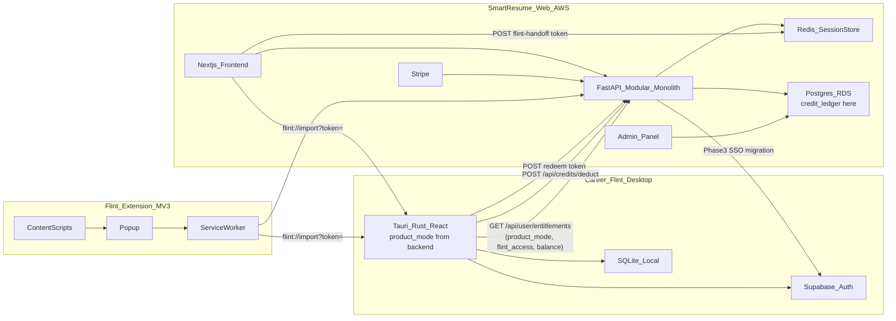

# Strategy B — Smart Resume + Flint Integration Plan

**Companion:** [STRATEGY_B_E2E_RUNBOOK.md](./STRATEGY_B_E2E_RUNBOOK.md) (manual verification steps)  
**Scope:** Smart Resume web + Flint desktop + Chrome extension — six phases from link handoff through optional backend unification.

## Verdict

**Approve with changes** — Strategy B is correct. This plan incorporates the revised phase order (billing before autofill), codebase-validated file paths, naming fixes to avoid collisions with existing Smart Resume export routes, and explicit risk mitigations from the prior review.

## Architecture



### Modular Monolith — Smart Resume internal structure

```
smart-resume/backend/app/
  routers/          # HTTP surface only — no business logic
  services/
    auth/           # Supabase JWT validation
    billing/        # Stripe, plans, Flint access flag
    sessions/       # Resume tailoring pipeline
    flint/          # handoff, redeem, digest sync, credit deduction
    questions/      # Future: interview question corpus (stub now)
    admin/          # Admin panel backend
  models/           # Shared DB models — no cross-service SQL ad hoc
```

**No cross-module SQL.** Each service module owns its tables. Shared data via explicit service calls.

**Extraction triggers** (write ADR when hit):
1. Question corpus needs Elasticsearch → extract `services/questions/` to separate deploy
2. Billing Stripe webhook volume > 10k/day → extract `services/billing/`
3. Separate engineering team takes ownership of a module

## Prerequisites (before Phase 1)

| Gate | Repo | Action |
|------|------|--------|
| Phase 7.7 merged | Flint | Merge `chore/phase7-security-audit` → `main` (security baseline before cross-product data transport) |
| `.env.example` added | Flint | Create `.env.example` with `FLINT_SUPABASE_*`, `FLINT_SMART_RESUME_URL`, `FLINT_LOG` |
| ADR-001 committed | smart-resume | **Supabase SSO for both:** Smart Resume migrates from HS256 JWT to Supabase GoTrue; Flint keeps existing Supabase auth — single identity for billing |

**Not a Phase 1 blocker:** Phase 7.8 installers — required before extension beta (between Phase 1 and Phase 2 public rollout), not before link development.

---

## Risk Register (addressed per phase)

| Risk | Mitigation | Phase |
|------|------------|-------|
| Token in URL path leaks to logs/CDN/Referer | Token only in POST body (redeem) and `flint://` query param; never in FastAPI path | 1 |
| Redis single-use race | `GETDEL` atomic redeem; export uses `SET key payload EX 600 NX` | 1 |
| `flint://` fails when Flint not running | Cold-start arg parsing + 3s UI fallback on Smart Resume | 1 |
| Naming collision with `GET /api/sessions/{id}/export` (PDF) | New route: `POST /api/sessions/{id}/flint-handoff` | 1 |
| `jd_raw` only in Redis, not Postgres | Handoff reads live Redis `Session`; extension JD save persists to new `job_descriptions` table | 1, 2 |
| MV3 service worker killed, auth lost | `chrome.alarms` for refresh; all state in `chrome.storage.local` | 2 |
| Chrome Web Store review 2–4 weeks | Submit early; parallel with remaining Phase 2 work | 2 |
| Deep link vs native messaging undecided | ADR-002: deep link for Phase 2; native messaging deferred to Phase 4+ | 2 |
| Dual auth blocks billing | Supabase SSO migration (ADR-001) in Phase 3 | 3 |
| Autofill DOM maintenance | Selectors in versioned JSON; weekly regression CI on HTML snapshots | 4 |
| Phase 6 never triggers | Written trigger in ADR-003: AWS > 15% MRR for 2 months OR 500 MAU | 6 |

---

## Phase 1 — Link Plan (2–4 weeks)

**Branch:** `feature/smart-resume-link` (both repos)  
**Goal:** Tailored session in Smart Resume opens Flint `SessionDesign` pre-filled with JD, profile summary, and metadata.

### Smart Resume (FastAPI)

**Agent:** Cursor Agent (Sonnet) + pytest for backend tests

#### 1.1 Export token endpoint

- **New file:** `smart-resume/backend/app/routers/flint_handoff.py`
- **Route:** `POST /api/sessions/{session_id}/flint-handoff` (auth: Bearer JWT via `dependencies.py`)
- **Logic:**
  - Load session from `session_store.py` — `jd_raw`, `phase3_output`, `user_id` from `models/session.py`
  - Build payload (max 2000 chars for `resume_summary`):
    ```json
    {
      "session_name", "session_type", "domain",
      "jd_text", "resume_summary",
      "company_overview",
      "company_values",
      "smart_resume_session_id",
      "export_version": 2,
      "user_id", "created_at"
    }
    ```
    Backward compatibility: `export_version: 1` payloads (pre-v1.5) have no `company_overview` or `company_values`; Flint treats missing fields as empty strings.
  - Store in Redis: `flint:handoff:{token}` with `SET ... EX 600 NX`
  - Return `{ "token": "<uuid>", "expires_in": 600 }`
- **Register** in `backend/app/main.py`
- **Config:** add `FLINT_HANDOFF_TTL_SECONDS=600` to `backend/app/config.py`

**Tests** (`backend/tests/unit/test_flint_handoff.py`):

- Authenticated POST returns token; Redis key exists with TTL ≤ 600
- Unauthenticated → 401; missing session → 404
- Session without `phase3_output` → 422
- Payload truncates `resume_summary` at 2000 chars

#### 1.2 Redeem endpoint (public, single-use)

- **Route:** `POST /api/flint/context` (no auth — token is credential)
- **Body:** `{ "token": "<uuid>" }` — **not** in URL path
- **Logic:** Redis `GETDEL flint:handoff:{token}`; 404 if missing/expired
- **Rate limit:** 10/min per IP via existing `limiter`
- **Logging:** never log `jd_text`, `resume_summary`, or token value at INFO+

**Tests** (`backend/tests/unit/test_flint_context.py`):

- Valid token → 200 + payload; second call → 404
- Expired token → 404; malformed token → 404
- 11th request/min → 429

#### 1.3 "Open in Flint" UI button

- **New file:** `frontend/components/session/OpenInFlintButton.tsx`
- **Wire into:** session review UI (post Phase 3/4 completion) alongside existing `ExportButtons.tsx`
- **API helper:** add `createFlintHandoff(sessionId)` to `frontend/lib/api.ts`
- **Flow:** POST handoff → `window.location.href = flint://import?token={token}` → 3s fallback if `document.hasFocus()` still true: "Flint not installed — Download"

**Tests** (`frontend/tests/components/OpenInFlintButton.test.ts` via tsx):

- Calls handoff once; constructs `flint://import?token=`
- Shows fallback after 3s mock timeout

### Flint (Tauri)

**Agent:** Cursor Agent (Sonnet); Opus Thinking only if deep-link cold-start edge cases are subtle

#### 1.4 Deep link registration

- **Files:**
  - `src-tauri/tauri.conf.json` — add `tauri-plugin-deep-link`, scheme `flint`
  - **New:** `src-tauri/src/deep_link.rs` — parse `flint://import?token=`
  - `src-tauri/src/lib.rs` — register plugin in `setup`, emit `deep_link_received { url }`
  - `src-tauri/src/main.rs` — cold-start arg parse
  - `src-tauri/capabilities/default.json` — deep-link permission

**Tests** (`src-tauri/src/deep_link.rs` unit):

- Parse valid/invalid URLs; extract token; reject empty

#### 1.5 `import_from_smart_resume` command

- **New:** `src-tauri/src/smart_resume.rs` — HTTP client (`reqwest`, 10s timeout)
- **Extend:** `src-tauri/src/commands.rs` + `src-tauri/src/dto.rs` — `SmartResumeImportDto`
- **Env:** `FLINT_SMART_RESUME_URL` (document in `.env.example`)
- **Command:** `import_from_smart_resume(token)` → POST redeem endpoint → return DTO

**Tests** (`src-tauri/tests/integration/smart_resume_import.rs`):

- Mock 200/404/429/timeout responses
- Token validation before HTTP call

#### 1.6 Frontend wiring

- **Extend** `SessionPreFill` in `src/screens/SessionDesign.tsx`: add `profileText?`, `smartResumeSessionId?`
- **Extend** `src/App.tsx`: listen `deep_link_received` → call import → set `sessionPreFill` + `localStorage["flint.userProfile"]` → navigate to `session-design`
- **Extend** `src/commands/index.ts` + `src/events/index.ts`

**Tests** (Vitest):

- Deep link success → correct `preFill` values
- 404 → toast, no navigation; profile localStorage not corrupted

### Phase 1 Review Gate

- [x] Smart Resume → Flint pre-fill works locally end-to-end (JD, profile, company culture/mission pre-filled) — **1.A signed off 2026-06-09** (Fisher session: mission visible in Session Design after re-handoff + rebuild)
- [x] **1.B cold start** — code complete: `capture_cold_start_token()` + `capture_cold_start_token_from_env()` in `deep_link.rs`; `AppState::new` uses it; 5 cold-start integration tests pass (`cargo test --test cold_start`). **Manual on-device test still pending**: register `flint://` via `npm run deeplink:register`, quit app, click "Open in Flint" from Smart Resume, verify pre-fill.
- [x] Second redeem returns expired error (`test_flint_context.py::test_second_redeem_returns_404`)
- [x] No session content in INFO+ logs (`test_flint_context.py::test_handoff_paths_do_not_log_session_content`; only `flint_handoff.corrupt_payload` at WARN, no payload fields)
- [x] Automated suites green for Phase 1 scope:
  - `uv run pytest backend/tests/unit/test_flint_handoff.py backend/tests/unit/test_flint_context.py`
  - `cargo test deep_link` + `cargo test --test smart_resume_import` + `cargo test --test cold_start`
  - `npm run test:phase1` (Flint) + `node --test tests/components/OpenInFlintButton.test.ts tests/lib/flintDeepLink.test.ts` (Smart Resume frontend)
- [ ] **Note:** Pre-warm and rehearsal turns are unmetered in this phase — credit ledger does not exist until Phase 3. The `ingest_context` and `confirm_digest` commands call LLM unconditionally. Credit gating is added in Phase 3.

**Not Phase 1 (do not block this gate):** Phase 1.5 distribution/installers; `export_version: 2` structured `company_overview` / `company_values` (v1.5); Phase 2 extension; Phase 3 billing/SSO.

---

## Phase 1.5 — Distribution (7.8) before extension beta (2–3 weeks)

**Branch:** `chore/phase7-distribution` (Flint only)  
**Agent:** Shell agent + manual VM testing

- Signed installers (macOS notarization, Windows Authenticode)
- Register `flint://` protocol handler in installer
- Test on clean macOS/Windows/Linux VMs per [ROADMAP.md](./ROADMAP.md)
- **Blocks:** extension public beta only — not Phase 1 dev or internal dogfooding

---

## Phase 2 — Extension MVP (6–8 weeks wall clock)

**New repo:** `flint-extension`  
**Branch:** `feature/extension-mvp`  
**Goal:** Auth, JD capture, Save JD, Open in Flint. **No autofill.**

### 2.0 ADR-002 (before coding)

- **File:** `flint-extension/docs/adr/002-extension-desktop-ipc.md`
- **Decision:** `flint://` deep link for Phase 2 (one-way); native messaging deferred

### 2.1 Extension scaffold (MV3)

**Agent:** Shell agent

```
flint-extension/
  manifest.json
  background/service-worker.ts
  popup/Popup.tsx
  content/jd-extractor.ts
  src/auth.ts, api.ts, storage.ts
```

- Permissions: `storage`, `activeTab`, `scripting`, `alarms` only
- No module-level mutable state in service worker

### 2.2 Extension auth (post ADR-001 partial readiness)

**Agent:** Cursor Agent (Sonnet)

- Login against Smart Resume `/api/auth/login` (until SSO migration completes in Phase 3, extension uses existing JWT; Phase 3 migrates extension to Supabase OAuth)
- Tokens in `chrome.storage.local`
- `chrome.alarms.create('token-refresh', { periodInMinutes: 25 })` — survives SW restart

**Tests:** token refresh alarm; SW restart simulation; refresh failure shows login prompt

### 2.3 JD extraction content script

**Agent:** Cursor Agent (Sonnet)

- Structured selectors config for LinkedIn + Greenhouse
- Heuristic fallback: largest text block > 100 chars
- Returns `ExtractedJD { title, company, text, url, extraction_method }`

**Tests:** mock DOM fixtures for LinkedIn/Greenhouse; heuristic fallback; XSS-safe string-only output

### 2.4 Save JD + Open in Flint popup flow

**Agent:** Cursor Agent (Sonnet)

Popup states: not logged in → logged in on job page → not on job page

- "Save JD" → new Smart Resume endpoint (2.5)
- "Open in Flint" → `flint-handoff` token → `flint://import?token=`

### 2.5 Smart Resume: durable JD + handoff combo

**Agent:** Cursor Agent (Sonnet)

- **Migration:** `backend/alembic/versions/XXXX_job_descriptions.py` — `job_descriptions` table with RLS (`user_id` scoped)
- **Route:** `POST /api/job-descriptions` — `{ url, title, company, text, source: "extension" }`
- **Response:** `{ jd_id, export_token }` — calls same handoff logic internally
- **Note:** existing `POST /api/sessions/{id}/jd` remains for in-app tailoring; extension uses durable table

**Tests:** pytest integration — save, RLS isolation, text truncated at 20k chars

### 2.6 E2E smoke + store submission

**Agent:** `browser-use` for Playwright smoke; **manual** for Chrome Web Store

- Load extension in headless Chrome; mock job page; verify extraction + deep link URL
- Submit to Chrome Web Store **as soon as code is reviewable** (budget 2–4 weeks parallel)

### Phase 2 Review Gate

- [x] Login, Save JD, Open in Flint — code complete
- [x] Automated API gate (2026-06-11): register/login, `POST /api/job-descriptions`, redeem payload verified (`session_name`, `jd_id`, `jd_text`)
- [x] Integration tests: 12/12 pass (`test_job_descriptions.py` + `test_extension_auth.py` with `DATABASE_URL`)
- [x] Extension unit tests: 15/15 vitest pass
- [x] ADR-002 committed
- [x] `flint-extension` merged to `main` (2026-06-11); Smart Resume Phase 2 backend already on `main`
- [ ] `web-ext lint` — 1 Firefox-only error (`MANIFEST_FIELD_UNSUPPORTED` for nested `background/service_worker`; valid Chrome MV3)
- [ ] Store listing submitted (manual — Chrome Web Store submission)
- [ ] Manual end-to-end in Chrome: load unpacked `dist/`, LinkedIn job → Save JD → Open in Flint → verify Session Design pre-fill

---

## Phase 3 — Shared Billing + Supabase SSO (5–7 weeks)

**Branches:** `feature/supabase-sso` (smart-resume), `feature/flint-entitlements` (Flint)  
**Goal:** One identity, one subscription, one unified credit ledger gates both products.

### 3.1 Supabase SSO migration (ADR-001 implementation)

**Agent:** Cursor Agent (Opus Thinking) for auth migration design; Sonnet for implementation

**Smart Resume changes:**

- Add Supabase GoTrue client; migrate `backend/app/services/auth/tokens.py` HS256 paths to Supabase JWT validation
- Update `frontend/auth.ts` NextAuth provider to Supabase
- Migration script: map existing `users` table to Supabase `auth.users` (email-based)
- **Rollback plan:** feature flag `USE_SUPABASE_AUTH` in config

**Flint:** no auth change — already Supabase via `src-tauri/src/supabase/auth.rs`

**Tests:**

- Login/signup/refresh E2E on Smart Resume
- Existing user migration smoke test
- Flint login unchanged

### 3.2 Unified credit ledger

**Agent:** Cursor Agent (Sonnet)

**Smart Resume — new tables and routes:**

- **Migration:** `backend/alembic/versions/XXXX_credit_ledger.py`
  ```sql
  CREATE TABLE credit_ledger (
    id UUID PRIMARY KEY,
    user_id UUID NOT NULL REFERENCES auth.users(id),
    balance INTEGER NOT NULL DEFAULT 0,
    updated_at TIMESTAMPTZ DEFAULT NOW()
  );
  CREATE TABLE credit_transactions (
    id UUID PRIMARY KEY,
    user_id UUID NOT NULL,
    action TEXT NOT NULL,          -- e.g. "rehearsal_turn", "resume_tailor"
    product TEXT NOT NULL,         -- "career_flint" | "smart_resume"
    amount INTEGER NOT NULL,       -- negative = debit, positive = credit
    session_id TEXT,
    created_at TIMESTAMPTZ DEFAULT NOW()
  );
  ```
- **Route:** `POST /api/credits/deduct` — `{ user_id, action, product, session_id }` → looks up cost from `credit_costs` config table, deducts, returns new balance
- **Route:** `GET /api/credits/balance` → `{ balance, transactions_last_30d }`
- **Credit costs table** — admin-configurable, not hardcoded:
  ```
  action             product          cost_credits
  digest_extraction  career_flint     10
  pre_warm           career_flint     50
  rehearsal_turn     career_flint     15
  research_chat_msg  career_flint     8
  live_turn          career_flint     15
  resume_tailor      smart_resume     50
  cover_letter       smart_resume     30
  jd_analysis        smart_resume     20

  -- v2 actions (added when Mock Interview ships):
  mock_grade         career_flint     25
  ```

**Flint desktop — credit integration:**

- **New:** `src-tauri/src/credit_client.rs` — `CreditClient` trait + `SmartResumeCreditClient` impl
- **Pre-authorize at session start:** call `GET /api/credits/balance`; if < minimum for session type, block with "Insufficient credits" message. Minimum thresholds (admin-configurable defaults): interview Live = 100 credits; rehearsal-only = 25 credits.
- **Deduct per action:** `ingest_context`, `run_rehearsal_turn`, `run_research_chat` each call `deduct` before LLM call
- **Live session pre-authorization and reconciliation:**
  - At `start_session`: call `POST /api/credits/hold` — `{ user_id, session_id, amount: N }` — creates a `pending_holds` row in Postgres
  - Per-turn: call `POST /api/credits/deduct` with `hold_id`; Postgres moves credits from hold to actual debit
  - On `ENDED`: call `POST /api/credits/release-hold` — releases any unused hold back to balance
  - On `CRASHED` and not recovered within 24h: an Edge Function auto-releases stale holds to prevent balance lock
  - Schema addition: `CREATE TABLE pending_holds (id UUID, user_id UUID, session_id TEXT, amount INTEGER, created_at TIMESTAMPTZ);`
- **BYOK users:** skip credit check entirely (keychain has API key); emit `token_usage_update` as before
- **Mid-Live credit exhaustion policy:** at 50% balance remaining → amber toast; at 25% → red toast; at 0 → warn toast, fall back to local Ollama if available, continue session, log overage for post-session reconciliation. **Never hard-stop a Live session for credits.**
- **Offline credit API fallback:** if `GET /api/credits/balance` fails at session start, cache the last known balance and cost table (TTL 60 seconds). If cached balance is sufficient, allow session to proceed. If API is unreachable and no cache exists, block platform-credit users with "Credit service unavailable — try again shortly." BYOK users are unaffected.

**Tests:**
- Deduct → balance decremented; second call with 0 balance → blocked
- BYOK path → no credit call made
- 500 from credit API → session continues (non-fatal, log warn); retry on next action
- Live hold → per-turn debit → ENDED release: final balance correct
- CRASHED hold → 24h Edge Function auto-release: balance restored
- Offline (mock 500 on balance check) → cached balance used → session allowed; no cache → blocked with user-visible error

### 3.3 `flint_access` + `product_mode` entitlement

**Agent:** Cursor Agent (Sonnet)

- Extend `GET /api/user/entitlements` → `{ flint_access, plan, credits_remaining, product_mode: "career" | "flint" }`
- `product_mode` set by admin panel per account or per plan
- Flint desktop: `EntitlementChecker` reads `product_mode` and `flint_access`; gates session types shown in UI; sets window title ("Career Flint" or "Flint")
- **Career mode:** interview template only; Mock Interview visible; consulting templates hidden
- **Flint mode:** all templates; interview works; Mock Interview visible if plan allows

**Tests:** `product_mode: career` → no consulting sessions; `flint` → all visible; `flint_access: false` → session blocked

### 3.4 Entitlement gate on all metered Rehearsal actions

**Agent:** Cursor Agent (Sonnet)

- Extend `entitlement.rs`: `check_credits_before_action(action, product)` — checks balance > cost for action
- Wire into: `ingest_context`, `confirm_digest` (pre-warm), `run_rehearsal_turn`, `run_research_chat`
- Wire into `start_session`: pre-authorize Live budget
- Free trial gate: check `free_trial_turns_used < max` from entitlements response

**Tests:** free trial limit reached → blocked with upgrade prompt; BYOK → no gate

### 3.5 Post-interview digest sync

**Agent:** Cursor Agent (Sonnet)

- **Route:** `POST /api/sessions/{id}/interview-digest` on Smart Resume
- **Flint:** `src-tauri/src/smart_resume_sync.rs` — best-effort POST after `ENDED`; payload: `{ key_topics, confidence_distribution, low_confidence_areas, duration_ms }` — **no transcript text**
- Store `smart_resume_session_id` in Flint SQLite session metadata during import

**Tests:** sync fires when ID present; 500 does not block ENDED; no transcript in payload

### 3.6 Billing UI in Flint

- Settings screen: plan status, credits remaining, "Manage subscription" opens Smart Resume billing portal via `tauri-plugin-opener`
- Per-session usage breakdown accessible from session list

### 3.7 Admin panel — Flint

**Agent:** Cursor Agent (Sonnet)

- **New app:** `flint-admin/` — Next.js app or route within Smart Resume admin
- **Auth:** Supabase JWT with `role = admin` claim
- **Pages:**
  - `users/` — list, search, suspend, assign plan, set `product_mode`, grant credits
  - `credits/` — view ledger, adjust balance, view burn rate per user/action
  - `plans/` — define tier limits (free trial config, credit allocations, BYOK flag)
  - `credit-costs/` — edit cost per action per product (no deploy required)
  - `feature-flags/` — enable/disable features per plan
  - `analytics/` — credits burned per day/user/feature; error rates

### Phase 3 Review Gate

- [ ] Single Supabase login works on Smart Resume + Flint
- [ ] `flint_access: false` blocks `start_session` with user-visible message
- [ ] Credit deducted on `run_rehearsal_turn`; balance decrements in widget
- [ ] BYOK user: no credit call, sees tokens not credits
- [ ] `product_mode: career` hides consulting templates; title shows "Career Flint"
- [ ] Free trial limit reached → upgrade prompt (no hard crash)
- [ ] Admin: change `rehearsal_turn` cost → reflected in next session widget
- [ ] Digest sync best-effort after ENDED; 500 does not block transition
- [ ] Extension auth updated to Supabase OAuth flow
- [ ] **End-to-end credit scenario:** user starts with 100 credits → ingest (−10) → pre-warm (−50) → 3 rehearsal turns (−45) → 2 research chat messages (−16) → Live session 5 turns (−75) → final balance = 100 − (10+50+45+16+75) = −96 (overage) → session completed; widget breakdown matches credit_transactions log; overage reconciled post-session
- [ ] Live hold on `start_session` → per-turn debit → ENDED releases unused hold → balance correct
- [ ] Mock credit API (500) during Rehearsal → cached balance used → session proceeds; cold-start with no cache → blocked with user-visible error

---

## Phase 4 — Autofill v1 (gated: 50 paying users OR $500 MRR)

**Branch:** `feature/extension-autofill-v1`  
**Duration:** 6–8 weeks + 1–2 days/month ongoing maintenance per ATS target

### 4.1 Autofill payload endpoint

- `GET /api/job-descriptions/{jd_id}/autofill-payload` — structured fields + 15-min pre-signed S3 resume PDF URL
- HMAC signature in `X-Payload-Signature` header

### 4.2 Extension autofill architecture

- Service worker fetches payload; content script fills DOM
- **Files:** `content/autofill/greenhouse.ts`, `content/autofill/linkedin.ts`
- Selectors externalized to `content/autofill/selectors.json` (data-only store updates)
- `FillResult { fields_attempted, fields_filled, fields_failed }` — per-field try/catch, never abort all

### 4.3 DOM maintenance CI

**Agent:** Shell agent

- `.github/workflows/autofill-regression.yml` — weekly run against checked-in HTML snapshots
- Fail + alert when selector resolves to zero elements

### 4.4 Chrome Web Store update

- Update privacy policy; justify `host_permissions` for `greenhouse.io`, `linkedin.com`
- Budget 1–2 weeks review

### Phase 4 Review Gate

- [ ] ≥ 90% field fill on current production DOM (both targets)
- [ ] Regression CI green
- [ ] Partial fill reports failed fields to user

---

## Phase 5 — Job Search (optional, deferred)

**Gate:** Phase 4 live ≥ 8 weeks with autofill usage; user demand validated

- Enable Apify/Hirebase cron (+~$45/mo)
- Surface in Smart Resume; extension "Save JD" as entry point
- No detailed plan until gate met

---

## Phase 5.5 — Interview Question Corpus API (deferred, plan stub)

**Gate:** Flint Phase 9 (dual vector stores) shipped + v2 Mock Interview shipped + ≥ 500 quality-gated Q&A pairs per domain accumulated from production sessions  
**Full design:** `Flint/docs/QA_RETRIEVAL_AND_QUESTION_BANK.md`

**Goal:** Power the in-app question bank and live retrieval with a curated company/role/domain question corpus. Two tiers: (1) static curated dataset served from Smart Resume API; (2) a live-enriched shared question bank fed from anonymised session signal.

### Route Contract (defined now for compatibility planning)

| Route | Auth | Response |
|-------|------|----------|
| `GET /api/interview-questions?company=&role=&domain=` | Bearer JWT | `{ questions: [{ id, text, domain, tags, canonical_answer? }] }` |
| `GET /api/interview-questions/{id}/canonical` | Bearer JWT | `{ question_id, answer_text, confidence, last_updated }` |
| `POST /api/interview-questions/contribute` | Bearer JWT | `{ question_id, answer_text, session_id }` → opt-in only |

### Data Model

```sql
CREATE TABLE interview_questions (
    id UUID PRIMARY KEY,
    text TEXT NOT NULL,
    domain TEXT NOT NULL,          -- "software_engineering", "product", "finance", etc.
    role_tags TEXT[],              -- ["senior", "architect", "ic"]
    company_tags TEXT[],           -- ["faang", "startup", "finance"]
    difficulty TEXT,               -- "behavioural", "technical", "situational"
    source TEXT NOT NULL,          -- "curated", "session_signal", "community"
    canonical_answer TEXT,         -- NULL until agent pipeline completes
    canonical_confidence REAL,     -- 0.0–1.0; threshold 0.65 before surfacing to users
    canonical_updated_at TIMESTAMPTZ,
    created_at TIMESTAMPTZ DEFAULT NOW()
);

CREATE TABLE question_contributions (
    id UUID PRIMARY KEY,
    question_id UUID REFERENCES interview_questions(id),
    user_id UUID REFERENCES auth.users(id),
    answer_text TEXT NOT NULL,
    session_confidence REAL NOT NULL,   -- Flint confidence score from source session
    session_id TEXT NOT NULL,
    consented BOOLEAN NOT NULL DEFAULT FALSE,
    created_at TIMESTAMPTZ DEFAULT NOW()
);
```

RLS: `question_contributions` row visible only to owning `user_id` and `role = admin`. `interview_questions` readable by all authenticated users; writable only by service role.

### Agent Enrichment Pipeline (offline, not request-path)

Run as a background job or Supabase Edge Function on a schedule (nightly or on-demand):

```
For each question with >= 3 contributions (consented = TRUE):
    1. Generator: LLM synthesises candidate answer from all contributions
    2. Critic: separate LLM call evaluates candidate against a rubric
       - Factual accuracy (0–10)
       - Behavioural framework adherence (0–10)
       - Conciseness — 60–120 second verbal delivery (0–10)
       - Domain specificity vs genericism (0–10)
    3. If Critic total < 28/40: discard candidate, log for manual review
    4. Synthesiser: refine passing candidate based on Critic feedback
    5. Validator: final LLM + regex check — no factual claims that can't be grounded in the question context
    6. If Validator passes: set canonical_answer, canonical_confidence = avg_critic/40, canonical_updated_at = NOW()
    7. Publish to interview_questions table
```

This pipeline ensures bad answers in contributions never pollute the canonical answer seen by other users. A canonical answer is not surfaced until all four agents agree.

### Privacy Model

- Contributions opt-in only per session — never automatic
- Opt-in dialog shown once per account (BYOK users default opt-out; platform-credit users shown dialog)
- Contributions stored with `user_id` for GDPR deletion path
- Canonical answers are fully anonymised — no user attribution
- `GET /api/user/data-export` includes all `question_contributions` rows for the user

### Flint Desktop Integration

At session start (after question bank is seeded from digest), Flint queries:
```
GET /api/interview-questions?company={company}&role={role}&domain={domain}&limit=20
```
Merges results with local bank: local questions take priority; shared questions appended with `[suggested]` label.

During live/rehearsal retrieval (Section 16.5 dual-store): shared canonical answers, if available for a matched question, are injected as a third prompt slot labelled `[Industry-standard answer for this question type]`. This is a separate slot from the 6 context + 2 Q&A pair slots — it does not displace either.

### Flint Phase 9 Prerequisite

Phase 5.5 cannot ship before Flint Phase 9 (dual vector stores) because the shared canonical answers are embedded into the session Q&A store (`session_qa_<id>`) at session start — not kept in plain text. Without Phase 9's schema, there is no store to embed them into.

---

## Phase 6 — Backend Unification (optional, deferred)

**ADR-003 trigger (write now):** start when AWS costs > 15% MRR for 2 consecutive months **OR** 500 MAU

- Keep FastAPI stateless (no business logic in Lambda) until then
- Port criteria: revenue baseline + team capacity

---

## Agent Assignment Summary

| Work | Agent |
|------|-------|
| FastAPI endpoints + pytest | Cursor Agent (Sonnet) |
| Supabase SSO migration | Cursor Agent (Opus Thinking) + Sonnet |
| Flint Rust commands + integration tests | Cursor Agent (Sonnet) |
| Deep link cold-start edge cases | Opus Thinking (if needed) |
| Extension scaffold + MV3 | Shell agent |
| Extension auth/content/autofill | Cursor Agent (Sonnet) |
| Extension E2E smoke | `browser-use` |
| Autofill regression CI | Shell agent |
| Installers / signing (7.8) | Shell agent + manual VM |
| Chrome Web Store submission | Manual |
| ADR decisions | Human (001 chosen: Supabase SSO; 002/003 at phase start) |

---

## Timeline (realistic)

| Phase | Engineering | External | Wall clock |
|-------|-------------|----------|------------|
| 1 Link | 2–4 wk | — | 4 wk |
| 1.5 Distribution | 2–3 wk | — | 3 wk |
| 2 Extension MVP | 4–6 wk | 2–4 wk store review | 8 wk |
| 3 Billing + SSO | 5–7 wk | — | 7 wk |
| 4 Autofill (gated) | 6–8 wk | 1–2 wk store update | 10 wk |
| **Total to Phase 4** | | | **~7 months** |

---

## Biggest Risk

**Autofill DOM maintenance on LinkedIn/Greenhouse** — obfuscated class rotation and store re-review cycles create ongoing operational cost. Mitigated by: billing gate before Phase 4, externalized selectors, weekly regression CI, and budgeting 1–2 days/month per ATS target.

---

## Appendix — Feature Decision Log

### Company LP Web Scraping — SKIPPED

| | Decision |
|---|---|
| Feature | Scrape Amazon/Netflix/etc. careers pages to enrich company intel beyond the JD |
| Status | **Skipped — replaced by JD-text extraction** |
| Flag | `COMPANY_LP_SCRAPING_ENABLED = False` (never implemented; no feature flag needed until revisited) |

**Why skipped:**

- Most JDs contain "About Us", "Our Mission", "Our Values", "Why Join Us" sections — sufficient signal without an HTTP round-trip.
- Web scraping adds: HTTP latency, scrape failures, rate-limit risk, robots.txt/ToS violations, HTML parser maintenance.
- JD-text extraction with `gemini-2.5-flash-lite` + 30-day cache keeps cost under $0.003 per company lookup with no additional infrastructure.
- **Revisit condition:** If >20% of sessions have empty company intel (no "About" section in JD), consider LP scraping for high-signal domains (Amazon, Google, Meta) only, with strict robots.txt compliance and exponential backoff.

### Feed Company Intel into Flint `{interviewer_priorities}` — IN PROGRESS

| | |
|---|---|
| Status | `feature/flint-handoff-company-intel` (Smart Resume) + `feature/company-intel-from-handoff` (Flint) |
| Approach | Add `company_intel` block to handoff payload; Flint appends it to `contextText`; digest LLM extracts values as `key_skills`; appears in `{interviewer_priorities}` at live-session time |
| No new prompt variables | Backward compatible — if `company_intel` absent, behavior unchanged |
